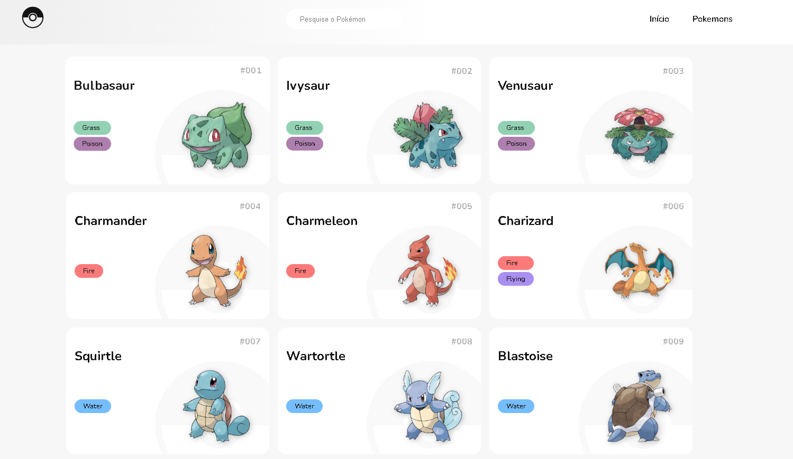

# Pokédex 151 Pokémons

Uma Pokédex interativa com todos os 151 Pokémons da região de Kanto, construída com React, Vite e Tailwind CSS.

## Screenshots



## ✨ Funcionalidades

- Lista de todos os 151 Pokémons da geração original
- Busca por nome do Pokémon
- Página de detalhes com:
  - Foto oficial de alta qualidade
  - Tipos do Pokémon
  - Atributos base (stats) com barras visuais
  - Habilidades com descrição em português
  - Cadeia de evoluções
- Design responsivo e elegante
- Interface em português

## 🛠️ Tecnologias

- **React** - Biblioteca JavaScript para interfaces
- **Vite** - Build tool rápido e moderno
- **Tailwind CSS** - Framework de estilização
- **PokéAPI** - API pública com dados dos Pokémon

## 🚀 Começando

### Pré-requisitos

- Node.js 18+ instalado

### Instalação

```bash
# Clone o repositório
git clone https://github.com/wincklerhigher/Pokedex-151-Pokemons.git
cd pokedex-react

# Instale as dependências
npm install

# Inicie o servidor de desenvolvimento
npm run dev
```

O projeto estará disponível em `http://localhost:5173`

## 📁 Estrutura do Projeto

```
pokedex-react/
├── src/
│   ├── components/       # Componentes reutilizáveis
│   │   ├── AbilitiesSection.jsx
│   │   ├── EvolutionCard.jsx
│   │   ├── Footer.jsx
│   │   ├── Header.jsx
│   │   ├── PokemonCard.jsx
│   │   └── TypeBadge.jsx
│   ├── pages/           # Páginas da aplicação
│   │   ├── HomePage.jsx
│   │   └── PokemonPage.jsx
│   ├── services/        # Integração com APIs
│   │   └── pokeApi.js
│   ├── utils/          # Funções auxiliares
│   │   └── helpers.js
│   ├── App.jsx         # Componente principal
│   └── main.jsx        # Ponto de entrada
├── public/
│   └── pokeball.svg   # Ícone da Pokédex
├── vite.config.js       # Configuração do Vite
└── package.json       # Dependências do projeto
```

## 🔧 Decisões Técnicas

### Tailwind CSS v4

Este projeto usa a versão 4 do Tailwind CSS, que traz várias melhorias em performance e uso de memória. A configuração é feita via PostCSS:

```javascript
// postcss.config.js
export default {
  plugins: {
    '@tailwindcss/postcss': {},
  },
}
```

### Rota base

O projeto está configurado para ser hospedado em `https://wincklerhigher.github.io/Pokedex-151-Pokemons/`, por isso:

1. **vite.config.js** define o base path:
```javascript
base: '/Pokedex-151-Pokemons/',
```

2. **App.jsx** configura o React Router:
```javascript
<BrowserRouter basename="/Pokedex-151-Pokemons">
```

3. Recursos estáticos usam o caminho correto (ex: ícone da Pokéball no Header)

### Integração com PokéAPI

O serviço `pokeApi.js` faz a comunicação com a PokéAPI e inclui:

- **Cache em memória** para evitar requisições重复idas
- **Traduções das habilidades** em português brasileiro
- **Cores por tipo** para badges visuais
- **Cores por stat** para barras de atributos

### Components

#### PokemonCard
Exibe cada Pokémon na lista com:
-Imagem oficial
- Número na Pokédex
- Nome
- Tipos (badges coloridos)

#### TypeBadge
Badge colorido conforme o tipo do Pokémon. Cores definidas em `pokeApi.js`.

#### EvolutionCard
Mostra a cadeia de evoluções do Pokémon atual com:
- Condição de evolução
- seta indicando direção

#### AbilitiesSection
Seção expansível com as habilidades do Pokémon:
- Nome traduzido em português
- Descrição em português
- Indicador se é habilidade oculta (hidden ability)

### Páginas

#### HomePage
Página principal com:
- Lista de Pokémons em grid
- Campo de busca que filtra em tempo real

#### PokemonPage
Página de detalhes do Pokémon com:
- Imagem grande
- Nome e número
- Tipos
- Stats com barras visuais
- Habilidades (expansível)
- Cadeia de evoluções

## 📦 Building para Produção

```bash
npm run build
```

O build será gerado na pasta `dist/`, pronta para deploy no GitHub Pages.

## 🤖 Deploy Automático com GitHub Actions

O projeto já inclui workflow para deploy automático:

1. A cada push para `main`, o GitHub Actions compila e faz deploy
2. Não precisa configurarbranch específicos nas settings
3. O deploy acontece automaticamente

Para ativar:
1. Vá em **Settings > Pages** do repositório
2. Em **Build and deployment > Source**, selecione **GitHub Actions**
3. Save

## 🎨 Personalização

### Cores de Tipos

As cores dos tipos estão em `src/services/pokeApi.js`:

```javascript
export const TYPE_COLORS = {
  normal: { bg: '#f0f0f0', text: '#666' },
  fire: { bg: '#fff0e0', text: '#b85a00' },
  water: { bg: '#e0f0ff', text: '#1e5bb8' },
  // ...outros tipos
}
```

### Cores de Stats

同样的 arquivo contém cores para barras de atributos:

```javascript
export const STAT_COLORS = {
  hp: 'bg-gradient-to-r from-red-500 to-red-400',
  attack: 'bg-gradient-to-r from-orange-500 to-orange-400',
  // ...outros stats
}
```

### Traduções de Habilidades

Adicione novas habilidades em `pokeApi.js`:

```javascript
export const ABILITY_TRANSLATIONS = {
  overgrow: { name: 'Herbicultura', description: 'Aumenta poder quando PS baixo.' },
  // ...outras habilidades
}
```

## 📚 Aprendizados

Este projeto demonstra:

1. **React com Vite** - Setup moderno e rápido
2. **Tailwind CSS v4** - Estilização utility-first
3. **React Router** - Navegaçãoclient-side
4. **Integração com API REST** - Consumindo dados externos
5. **Componentização** -Dividindo a UI em partes reutilizáveis
6. **Design responsivo** - Layout que funciona em qualquer tamanho detela
7. **GitHub Pages** - Deploy de aplicação SPA

---

- [Acesse o site](https://wincklerhigher.github.io/Pokedex-151-Pokemons/)

## 🔗 Links úteis

- [Fork do projeto original da PokéAPI](https://github.com/PokeAPI/pokeapi)
- [Meu repositório](https://github.com/wincklerhigher/Pokedex-151-Pokemons)
- [Me siga no GitHub](https://github.com/wincklerhigher)